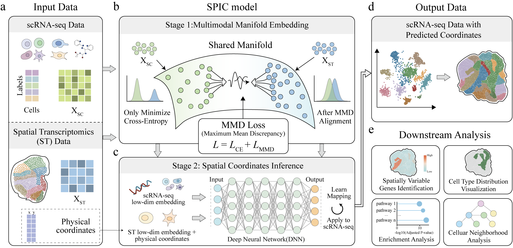

# SPIC: Spatial reconstruction of scRNA-seq data via cross-modal manifold alignment
SPIC is a deep learning framework designed for recovering spatial context of single cells within scRNA-seq datasets. SPIC leverages Riemannian geometry and algebraic topology to construct a shared nonlinear manifold for integrating scRNA-seq and ST data, followed by a position prediction neural network that directly infers precise spatial coordinates from the learned low-dimensional embeddings.

  

